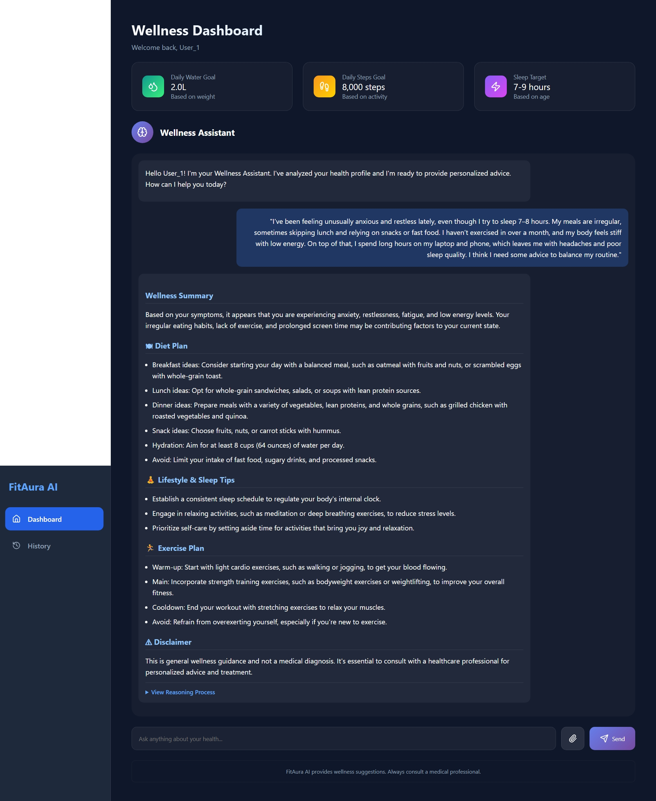

# Arogya — Multi-Agent Wellness Assistant (Frontend)

> A React 19 + Vite 7 progressive web application that streams real-time AI agent reasoning to the user — showing not just the final answer, but which specialist (Symptom, Diet, Fitness, Lifestyle) is responding and why, step by step.


🔗 **[Live Demo](https://digital-wellness-assistant.netlify.app/)** &nbsp;|&nbsp; **[Backend Repo](https://github.com/Karthik-bhandarkar/agent-backend)**

> ⚠️ **First load note:** The backend runs on Render's free tier and may take **30–50 seconds** to respond on first request after inactivity. After that, responses are fast.

---

## Dashboard Preview


*(To update this screenshot, replace `public/dashboard-preview.jpeg` in the repository)*


## What It Does

Arogya is a digital wellness chat interface powered by a multi-agent AI backend. When you send a message, the app streams live "thinking" updates — showing which AI specialist agent (e.g., Symptom Analyzer, Diet Planner) is currently working and what it's analyzing — before delivering the final combined response. This makes the AI reasoning transparent, not a black box.

**Key user-facing features:**
- Chat interface with real-time streaming of agent reasoning steps (SSE)
- User profile setup (health metrics, dietary preferences, fitness goals) that the AI agents use to personalize responses
- PDF medical report upload — agents can read and reference your lab results
- Persistent conversation history across sessions
- Works as an installable app (PWA) on mobile and desktop

---

## Tech Stack

| Layer | Technology |
|-------|-----------|
| Framework | React 19 |
| Build tool | Vite 7 |
| Routing | react-router-dom v7 |
| HTTP client | Axios with JWT interceptor |
| Realtime | Server-Sent Events (SSE) client |
| Notifications | react-hot-toast |
| Markdown rendering | react-markdown |
| PWA | vite-plugin-pwa (auto service worker, offline cache) |

---

## Local Setup

**1. Clone and install:**
```bash
git clone https://github.com/Karthik-bhandarkar/agent-Frontend.git
cd agent-Frontend
npm install
```

**2. Configure the backend URL:**

By default, the app talks to the **live deployed backend** on Render (`https://agent-backend-t11g.onrender.com`).

If you want to point it at a **local backend** instead, edit [`src/api/client.js`](./src/api/client.js) line 5:
```js
// Change this:
export const API_BASE_URL = "https://agent-backend-t11g.onrender.com";

// To this for local dev:
export const API_BASE_URL = "http://localhost:8000";
```

**3. Start the dev server:**
```bash
npm run dev
```

App will be live at `http://localhost:5173`.

---

## Connects To

Talks to the **[Arogya Backend](https://github.com/Karthik-bhandarkar/agent-backend)** via:
- **REST API** — for auth, profile, chat, history, and PDF upload
- **Server-Sent Events (SSE)** — for streaming real-time agent reasoning steps during a chat session

---

## PWA Support

This app is configured as a Progressive Web App using `vite-plugin-pwa`. It supports:
- Install-to-homescreen on Android and desktop (Chrome/Edge)
- Auto service worker updates (`registerType: 'autoUpdate'`)
- Offline asset caching for the app shell

---

## Known Limitations

- **Google login button** — The Google OAuth flow is implemented in the backend but not yet active in production. Clicking "Sign in with Google" will not work until the backend router is registered. Use email/password signup instead.
- **First response latency** — The backend cold starts on Render's free tier. First request after inactivity can take 30–50 seconds.

---

## Project Structure

```
src/
├── api/          # Axios client + endpoint functions (auth, chat, profile, history)
├── components/   # Reusable UI components
├── context/      # React context providers (auth state)
├── hooks/        # Custom React hooks
├── pages/        # Route-level page components
├── routes/       # Route definitions and protected route logic
├── styles/       # Global CSS
└── theme/        # Design tokens and theming
```

---

## License

MIT — see [LICENSE](LICENSE) for details.
