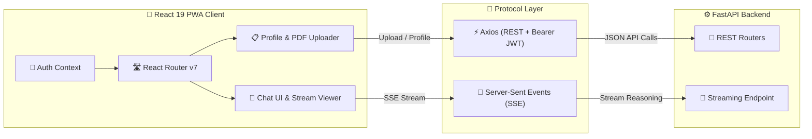

# 📱 Arogya — Multi-Agent Digital Wellness Assistant (Frontend)

<div align="center">

> **A high-performance React 19 + Vite 7 Progressive Web Application (PWA) with real-time AI reasoning streaming and interactive health management.**

[](https://react.dev/)
[](https://vitejs.dev/)
[](https://web.dev/progressive-web-apps/)
[](https://digital-wellness-assistant.netlify.app/)
[](LICENSE)

<br />

🔗 **[🌐 Live Web Application](https://digital-wellness-assistant.netlify.app/)** &nbsp;|&nbsp; ⚙️ **[Backend Repository](https://github.com/Karthik-bhandarkar/agent-backend)** &nbsp;|&nbsp; 📖 **[Backend API Docs](https://agent-backend-t11g.onrender.com/docs)**

</div>

---

> [!NOTE]
> **Live Backend Cold Start:** The backend service is hosted on Render's free tier and spins down during inactivity. The initial chat message or SSE connection may take **30–50 seconds** while the backend container starts. Subsequent requests respond rapidly.

---

## 🖼️ Dashboard Preview

<div align="center">


*Arogya Interactive Interface — Real-time AI Reasoning Feed & Personalized Health Dashboard*

</div>

---

## ✨ Features & User Capabilities

- 🤖 **Real-Time Agent Thinking Stream**: Displays live Server-Sent Events (SSE) showing which AI agent (Symptom, Diet, Fitness, Lifestyle) is currently active and why.
- 📋 **Comprehensive Profile Manager**: Allows users to input health metrics, dietary preferences, daily habits, and fitness goals to tailor AI recommendations.
- 📄 **Medical PDF Report Analyzer**: Users can upload diagnostic PDF reports, which are automatically parsed and incorporated into AI context.
- 💬 **Persistent Conversation History**: Past chat turns are saved to MongoDB and instantly accessible across sessions.
- 📲 **Installable Progressive Web App (PWA)**: Desktop & Mobile install support with offline fallback caching via `vite-plugin-pwa`.
- 🔐 **JWT Authentication**: Full client-side authentication with automatic token attachment and route protection.

---

## 🏗️ System Integration Architecture



---

## 🛠️ Tech Stack & Libraries

| Domain | Technology | Description |
| :--- | :--- | :--- |
| **Core Framework** | [React 19](https://react.dev/) | Component architecture with modern hooks & concurrency |
| **Build Tooling** | [Vite 7](https://vitejs.dev/) | Ultra-fast HMR dev server and optimized rollup bundler |
| **Routing** | `react-router-dom` v7 | Client-side routing with protected route wrapper guards |
| **HTTP Client** | `Axios` | Configured with automatic JWT request/response interceptors |
| **Realtime Client** | Native `EventSource` / SSE | Handles continuous text streaming and agent thought steps |
| **UI Notifications** | `react-hot-toast` | Sleek, customizable toast notifications |
| **Markdown Processing** | `react-markdown` | Renders rich text formatting and lists in AI chat responses |
| **PWA Engine** | `vite-plugin-pwa` | Workbox service worker generation & manifest management |

---

## 📂 Project Structure

```
agent-Frontend/
├── public/
│   ├── dashboard-preview.jpeg   # App preview screenshot
│   ├── favicon.ico              # Web app icon
│   └── pwa-192x192.png          # PWA mobile icon
├── src/
│   ├── api/                     # Axios API client & endpoint helpers
│   │   ├── client.js            # Base Axios instance & API_BASE_URL configuration
│   │   ├── auth.js              # Signup & login API calls
│   │   ├── chat.js              # Chat & streaming triggers
│   │   ├── profile.js           # Profile read/write endpoints
│   │   └── history.js           # Chat history retrieval
│   ├── components/              # Modular UI components
│   │   ├── ChatFeed.jsx         # Chat messages & SSE reasoning feed
│   │   ├── Header.jsx           # Top navigation bar
│   │   ├── Sidebar.jsx          # Session list & navigation drawer
│   │   └── ProtectedRoute.jsx   # Auth state route guard
│   ├── context/                 # React Context API providers
│   │   └── AuthContext.jsx      # Global authentication state
│   ├── pages/                   # Top-level page views
│   │   ├── Dashboard.jsx        # Main multi-agent chat interface
│   │   ├── Login.jsx            # User sign-in page
│   │   ├── Register.jsx         # User registration page
│   │   └── Profile.jsx          # Health metrics & PDF uploader page
│   ├── routes/                  # App route definitions
│   ├── styles/                  # Global CSS styles & layout rules
│   └── theme/                   # Color palettes & design tokens
├── index.html                   # HTML entry point
├── vite.config.js               # Vite & PWA configuration
└── package.json                 # Node dependencies & scripts
```

---

## 💻 Quick Start & Development Setup

### Prerequisites
- **Node.js**: v18.0.0 or higher
- **npm**: v9.0.0 or higher

### Step-by-Step Installation

1. **Clone the Repository:**
   ```bash
   git clone https://github.com/Karthik-bhandarkar/agent-Frontend.git
   cd agent-Frontend
   ```

2. **Install Dependencies:**
   ```bash
   npm install
   ```

3. **Configure Backend Endpoint (Optional):**
   By default, the frontend connects to the live deployed backend at `https://agent-backend-t11g.onrender.com`.

   To switch to a local backend instance, update `API_BASE_URL` in [`src/api/client.js`](./src/api/client.js):
   ```javascript
   // Change from live production URL:
   export const API_BASE_URL = "https://agent-backend-t11g.onrender.com";

   // To local dev URL:
   export const API_BASE_URL = "http://localhost:8000";
   ```

4. **Start Development Server:**
   ```bash
   npm run dev
   ```
   Open your browser and navigate to `http://localhost:5173`.

5. **Build for Production:**
   ```bash
   npm run build
   ```
   Output files will be generated in the `dist/` directory.

---

## 📱 Progressive Web App (PWA) Features

This web app is configured with `vite-plugin-pwa` for desktop and mobile PWA support:

- 📥 **Homescreen Installation**: Easily installable on Chrome, Edge, iOS Safari, and Android.
- ⚡ **Auto Update**: Configured with `registerType: 'autoUpdate'` to silently update assets when new versions are deployed.
- 📴 **Offline Caching**: Caches static assets (HTML, CSS, JS, fonts) for fast load times even on spotty networks.

---

## ⚠️ Known Issues & Notes

- **Google OAuth Button**: Google OAuth backend integration is currently in staging. Please use standard Email/Password authentication.
- **Render Service Spin-Down**: Free-tier backend hosting causes an initial 30-50 second delay on cold start requests.

---

## 📜 License

Distributed under the **MIT License**. See [`LICENSE`](LICENSE) for details.

<div align="center">
  <sub>Built with ❤️ by <a href="https://github.com/Karthik-bhandarkar">Karthik Bhandarkar</a></sub>
</div>
